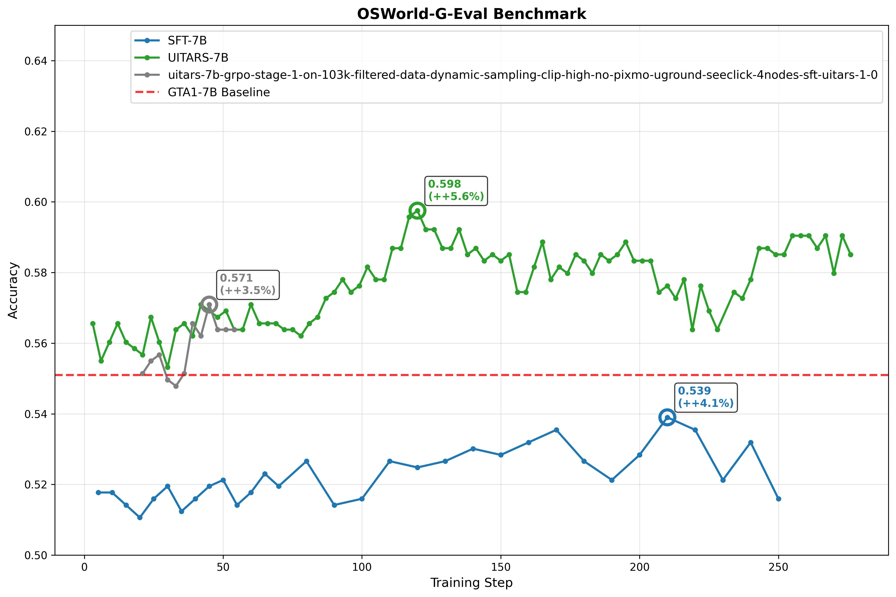
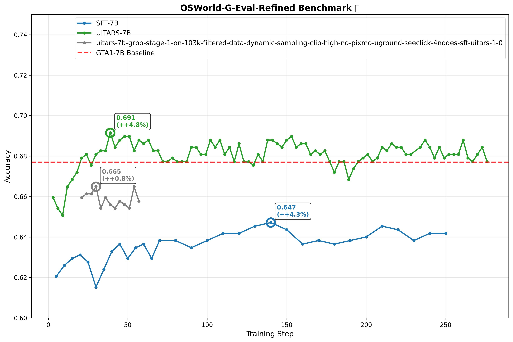
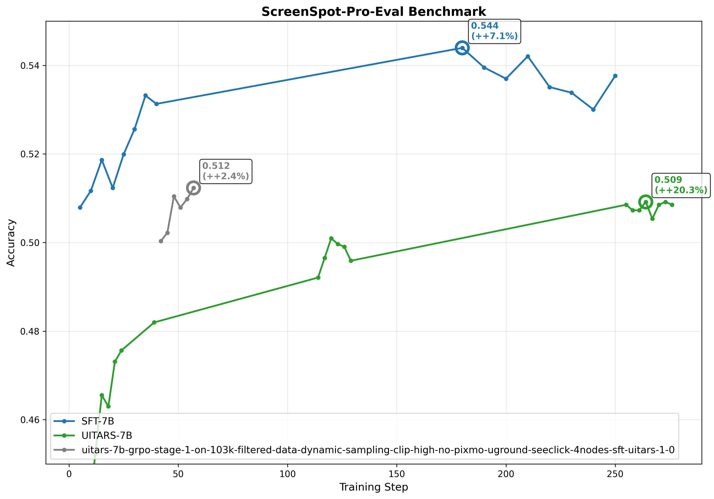

# DAPO RL Evaluation
# 2025-10-04
# Author: Anas

A bunch of evaluation results from the DAPO RL runs on Qwen SFT and UI-TARS Base/SFT models.

### grpo-7b-stage-1-on-103k-filtered-data-dynamic-sampling-clip-high-no-pixmo-uground-seeclick — osworld-g-eval
| step | accuracy | correct | total |
| --- | --- | --- | --- |
| 5 | 0.5725 | 292 | 510 |
| 10 | 0.5725 | 292 | 510 |
| 15 | 0.5686 | 290 | 510 |
| 20 | 0.5647 | 288 | 510 |
| 25 | 0.5706 | 291 | 510 |
| 30 | 0.5745 | 293 | 510 |
| 35 | 0.5667 | 289 | 510 |
| 40 | 0.5706 | 291 | 510 |
| 45 | 0.5745 | 293 | 510 |
| 50 | 0.5765 | 294 | 510 |
| 55 | 0.5686 | 290 | 510 |
| 60 | 0.5725 | 292 | 510 |
| 65 | 0.5784 | 295 | 510 |
| 70 | 0.5745 | 293 | 510 |
| 80 | 0.5824 | 297 | 510 |
| 90 | 0.5686 | 290 | 510 |
| 100 | 0.5706 | 291 | 510 |
| 110 | 0.5824 | 297 | 510 |
| 120 | 0.5804 | 296 | 510 |
| 130 | 0.5824 | 297 | 510 |
| 140 | 0.5863 | 299 | 510 |
| 150 | 0.5843 | 298 | 510 |
| 160 | **0.5882** | **300** | 510 |
| 170 | **0.5922** | **302** | 510 |
| 180 | 0.5824 | 297 | 510 |
| 190 | 0.5765 | 294 | 510 |
| 200 | 0.5843 | 298 | 510 |
| 210 | **0.5961** | **304** | 510 |
| 220 | **0.5922** | **302** | 510 |
| 230 | 0.5765 | 294 | 510 |
| 240 | **0.5882** | **300** | 510 |
| 250 | 0.5706 | 291 | 510 |

### grpo-7b-stage-1-on-103k-filtered-data-dynamic-sampling-clip-high-no-pixmo-uground-seeclick — osworld-g-eval-refined
| step | accuracy | correct | total |
| --- | --- | --- | --- |
| 5 | 0.6863 | 350 | 510 |
| 10 | 0.6922 | 353 | 510 |
| 15 | 0.6961 | 355 | 510 |
| 20 | 0.6980 | 356 | 510 |
| 25 | 0.6941 | 354 | 510 |
| 30 | 0.6804 | 347 | 510 |
| 35 | 0.6902 | 352 | 510 |
| 40 | 0.7000 | 357 | 510 |
| 45 | 0.7039 | 359 | 510 |
| 50 | 0.6961 | 355 | 510 |
| 55 | 0.7020 | 358 | 510 |
| 60 | 0.7039 | 359 | 510 |
| 65 | 0.6961 | 355 | 510 |
| 70 | 0.7059 | 360 | 510 |
| 80 | 0.7059 | 360 | 510 |
| 90 | 0.7020 | 358 | 510 |
| 100 | 0.7059 | 360 | 510 |
| 110 | 0.7098 | 362 | 510 |
| 120 | 0.7098 | 362 | 510 |
| 130 | **0.7137** | **364** | 510 |
| 140 | **0.7157** | **365** | 510 |
| 150 | **0.7118** | **363** | 510 |
| 160 | 0.7039 | 359 | 510 |
| 170 | 0.7059 | 360 | 510 |
| 180 | 0.7039 | 359 | 510 |
| 190 | 0.7059 | 360 | 510 |
| 200 | 0.7078 | 361 | 510 |
| 210 | **0.7137** | **364** | 510 |
| 220 | **0.7118** | **363** | 510 |
| 230 | 0.7059 | 360 | 510 |
| 240 | 0.7098 | 362 | 510 |
| 250 | 0.7098 | 362 | 510 |

### grpo-7b-stage-1-on-103k-filtered-data-dynamic-sampling-clip-high-no-pixmo-uground-seeclick — screenspot-pro-eval
| step | accuracy | correct | total |
| --- | --- | --- | --- |
| 5 | 0.5079 | 803 | 1581 |
| 10 | 0.5117 | 809 | 1581 |
| 15 | 0.5187 | 820 | 1581 |
| 20 | 0.5123 | 810 | 1581 |
| 25 | 0.5199 | 822 | 1581 |
| 30 | 0.5256 | 831 | 1581 |
| 35 | 0.5332 | 843 | 1581 |
| 40 | 0.5313 | 840 | 1581 |
| 180 | **0.5440** | **860** | 1581 |
| 190 | **0.5395** | **853** | 1581 |
| 200 | **0.5370** | **849** | 1581 |
| 210 | **0.5421** | **857** | 1581 |
| 220 | 0.5351 | 846 | 1581 |
| 230 | 0.5338 | 844 | 1581 |
| 240 | 0.5300 | 838 | 1581 |
| 250 | **0.5376** | **850** | 1581 |

### uitars-7b-grpo-stage-1-on-103k-filtered-data-dynamic-sampling-clip-high-no-pixmo-uground-seeclick-4nodes — osworld-g-eval
| step | accuracy | correct | total |
| --- | --- | --- | --- |
| 3 | 0.6255 | 319 | 510 |
| 6 | 0.6137 | 313 | 510 |
| 9 | 0.6196 | 316 | 510 |
| 12 | 0.6255 | 319 | 510 |
| 15 | 0.6196 | 316 | 510 |
| 18 | 0.6176 | 315 | 510 |
| 21 | 0.6157 | 314 | 510 |
| 24 | 0.6275 | 320 | 510 |
| 27 | 0.6196 | 316 | 510 |
| 30 | 0.6118 | 312 | 510 |
| 33 | 0.6235 | 318 | 510 |
| 36 | 0.6255 | 319 | 510 |
| 39 | 0.6216 | 317 | 510 |
| 42 | 0.6314 | 322 | 510 |
| 45 | 0.6294 | 321 | 510 |
| 48 | 0.6275 | 320 | 510 |
| 51 | 0.6294 | 321 | 510 |
| 54 | 0.6235 | 318 | 510 |
| 57 | 0.6235 | 318 | 510 |
| 60 | 0.6314 | 322 | 510 |
| 63 | 0.6255 | 319 | 510 |
| 66 | 0.6255 | 319 | 510 |
| 69 | 0.6255 | 319 | 510 |
| 72 | 0.6235 | 318 | 510 |
| 75 | 0.6235 | 318 | 510 |
| 78 | 0.6216 | 317 | 510 |
| 81 | 0.6255 | 319 | 510 |
| 84 | 0.6275 | 320 | 510 |
| 87 | 0.6333 | 323 | 510 |
| 90 | 0.6353 | 324 | 510 |
| 93 | 0.6392 | 326 | 510 |
| 96 | 0.6353 | 324 | 510 |
| 99 | 0.6373 | 325 | 510 |
| 102 | 0.6431 | 328 | 510 |
| 105 | 0.6392 | 326 | 510 |
| 108 | 0.6392 | 326 | 510 |
| 111 | 0.6490 | 331 | 510 |
| 114 | 0.6490 | 331 | 510 |
| 117 | **0.6588** | **336** | 510 |
| 120 | **0.6608** | **337** | 510 |
| 123 | **0.6549** | **334** | 510 |
| 126 | **0.6549** | **334** | 510 |
| 129 | 0.6490 | 331 | 510 |
| 132 | 0.6490 | 331 | 510 |
| 135 | **0.6549** | **334** | 510 |
| 138 | 0.6471 | 330 | 510 |
| 141 | 0.6490 | 331 | 510 |
| 144 | 0.6451 | 329 | 510 |
| 147 | 0.6471 | 330 | 510 |
| 150 | 0.6451 | 329 | 510 |
| 153 | 0.6471 | 330 | 510 |
| 156 | 0.6353 | 324 | 510 |
| 159 | 0.6353 | 324 | 510 |
| 162 | 0.6431 | 328 | 510 |
| 165 | 0.6510 | 332 | 510 |
| 168 | 0.6392 | 326 | 510 |
| 171 | 0.6431 | 328 | 510 |
| 174 | 0.6412 | 327 | 510 |
| 177 | 0.6471 | 330 | 510 |
| 180 | 0.6451 | 329 | 510 |
| 183 | 0.6412 | 327 | 510 |
| 186 | 0.6471 | 330 | 510 |
| 189 | 0.6451 | 329 | 510 |
| 192 | 0.6471 | 330 | 510 |
| 195 | 0.6510 | 332 | 510 |
| 198 | 0.6451 | 329 | 510 |
| 201 | 0.6451 | 329 | 510 |
| 204 | 0.6451 | 329 | 510 |
| 207 | 0.6353 | 324 | 510 |
| 210 | 0.6373 | 325 | 510 |
| 213 | 0.6333 | 323 | 510 |
| 216 | 0.6392 | 326 | 510 |
| 219 | 0.6235 | 318 | 510 |
| 222 | 0.6373 | 325 | 510 |
| 225 | 0.6294 | 321 | 510 |
| 228 | 0.6235 | 318 | 510 |
| 234 | 0.6353 | 324 | 510 |
| 237 | 0.6333 | 323 | 510 |
| 240 | 0.6392 | 326 | 510 |
| 243 | 0.6490 | 331 | 510 |
| 246 | 0.6490 | 331 | 510 |
| 249 | 0.6471 | 330 | 510 |
| 252 | 0.6471 | 330 | 510 |
| 255 | 0.6529 | 333 | 510 |
| 258 | 0.6529 | 333 | 510 |
| 261 | 0.6529 | 333 | 510 |
| 264 | 0.6490 | 331 | 510 |
| 267 | 0.6529 | 333 | 510 |
| 270 | 0.6412 | 327 | 510 |
| 273 | 0.6529 | 333 | 510 |
| 276 | 0.6471 | 330 | 510 |

### uitars-7b-grpo-stage-1-on-103k-filtered-data-dynamic-sampling-clip-high-no-pixmo-uground-seeclick-4nodes — osworld-g-eval-refined
| step | accuracy | correct | total |
| --- | --- | --- | --- |
| 3 | 0.7294 | 372 | 510 |
| 6 | 0.7235 | 369 | 510 |
| 9 | 0.7196 | 367 | 510 |
| 12 | 0.7353 | 375 | 510 |
| 15 | 0.7392 | 377 | 510 |
| 18 | 0.7431 | 379 | 510 |
| 21 | 0.7510 | 383 | 510 |
| 24 | 0.7529 | 384 | 510 |
| 27 | 0.7471 | 381 | 510 |
| 30 | 0.7529 | 384 | 510 |
| 33 | 0.7549 | 385 | 510 |
| 36 | 0.7549 | 385 | 510 |
| 39 | **0.7647** | **390** | 510 |
| 42 | 0.7569 | 386 | 510 |
| 45 | **0.7608** | **388** | 510 |
| 48 | **0.7627** | **389** | 510 |
| 51 | **0.7627** | **389** | 510 |
| 54 | 0.7549 | 385 | 510 |
| 57 | **0.7608** | **388** | 510 |
| 60 | 0.7588 | 387 | 510 |
| 63 | **0.7608** | **388** | 510 |
| 66 | 0.7549 | 385 | 510 |
| 69 | 0.7549 | 385 | 510 |
| 72 | 0.7490 | 382 | 510 |
| 75 | 0.7490 | 382 | 510 |
| 78 | 0.7510 | 383 | 510 |
| 81 | 0.7490 | 382 | 510 |
| 84 | 0.7490 | 382 | 510 |
| 87 | 0.7490 | 382 | 510 |
| 90 | 0.7569 | 386 | 510 |
| 93 | 0.7569 | 386 | 510 |
| 96 | 0.7529 | 384 | 510 |
| 99 | 0.7529 | 384 | 510 |
| 102 | **0.7608** | **388** | 510 |
| 105 | 0.7569 | 386 | 510 |
| 108 | **0.7608** | **388** | 510 |
| 111 | 0.7529 | 384 | 510 |
| 114 | 0.7569 | 386 | 510 |
| 117 | 0.7490 | 382 | 510 |
| 120 | 0.7588 | 387 | 510 |
| 123 | 0.7490 | 382 | 510 |
| 126 | 0.7490 | 382 | 510 |
| 129 | 0.7471 | 381 | 510 |
| 132 | 0.7529 | 384 | 510 |
| 135 | 0.7490 | 382 | 510 |
| 138 | **0.7608** | **388** | 510 |
| 141 | **0.7608** | **388** | 510 |
| 144 | 0.7588 | 387 | 510 |
| 147 | 0.7569 | 386 | 510 |
| 150 | **0.7608** | **388** | 510 |
| 153 | **0.7627** | **389** | 510 |
| 156 | 0.7569 | 386 | 510 |
| 159 | 0.7588 | 387 | 510 |
| 162 | 0.7588 | 387 | 510 |
| 165 | 0.7529 | 384 | 510 |
| 168 | 0.7549 | 385 | 510 |
| 171 | 0.7529 | 384 | 510 |
| 174 | 0.7549 | 385 | 510 |
| 177 | 0.7490 | 382 | 510 |
| 180 | 0.7431 | 379 | 510 |
| 183 | 0.7490 | 382 | 510 |
| 186 | 0.7490 | 382 | 510 |
| 189 | 0.7392 | 377 | 510 |
| 192 | 0.7451 | 380 | 510 |
| 195 | 0.7490 | 382 | 510 |
| 198 | 0.7510 | 383 | 510 |
| 201 | 0.7529 | 384 | 510 |
| 204 | 0.7490 | 382 | 510 |
| 207 | 0.7510 | 383 | 510 |
| 210 | 0.7569 | 386 | 510 |
| 213 | 0.7549 | 385 | 510 |
| 216 | 0.7588 | 387 | 510 |
| 219 | 0.7569 | 386 | 510 |
| 222 | 0.7569 | 386 | 510 |
| 225 | 0.7529 | 384 | 510 |
| 228 | 0.7529 | 384 | 510 |
| 234 | 0.7569 | 386 | 510 |
| 237 | **0.7608** | **388** | 510 |
| 240 | 0.7569 | 386 | 510 |
| 243 | 0.7510 | 383 | 510 |
| 246 | 0.7569 | 386 | 510 |
| 249 | 0.7510 | 383 | 510 |
| 252 | 0.7529 | 384 | 510 |
| 255 | 0.7529 | 384 | 510 |
| 258 | 0.7529 | 384 | 510 |
| 261 | **0.7608** | **388** | 510 |
| 264 | 0.7510 | 383 | 510 |
| 267 | 0.7490 | 382 | 510 |
| 270 | 0.7529 | 384 | 510 |
| 273 | 0.7569 | 386 | 510 |
| 276 | 0.7490 | 382 | 510 |

### uitars-7b-grpo-stage-1-on-103k-filtered-data-dynamic-sampling-clip-high-no-pixmo-uground-seeclick-4nodes — screenspot-pro-eval
| step | accuracy | correct | total |
| --- | --- | --- | --- |
| 3 | 0.4231 | 669 | 1581 |
| 6 | 0.4320 | 683 | 1581 |
| 9 | 0.4377 | 692 | 1581 |
| 12 | 0.4522 | 715 | 1581 |
| 15 | 0.4655 | 736 | 1581 |
| 18 | 0.4630 | 732 | 1581 |
| 21 | 0.4731 | 748 | 1581 |
| 24 | 0.4756 | 752 | 1581 |
| 39 | 0.4820 | 762 | 1581 |
| 114 | 0.4921 | 778 | 1581 |
| 117 | 0.4965 | 785 | 1581 |
| 120 | 0.5009 | 792 | 1581 |
| 123 | 0.4997 | 790 | 1581 |
| 126 | 0.4991 | 789 | 1581 |
| 129 | 0.4959 | 784 | 1581 |
| 255 | **0.5085** | **804** | 1581 |
| 258 | 0.5073 | 802 | 1581 |
| 261 | 0.5073 | 802 | 1581 |
| 264 | **0.5092** | **805** | 1581 |
| 267 | 0.5054 | 799 | 1581 |
| 270 | **0.5085** | **804** | 1581 |
| 273 | **0.5092** | **805** | 1581 |
| 276 | **0.5085** | **804** | 1581 |

### uitars-7b-grpo-stage-1-on-103k-filtered-data-dynamic-sampling-clip-high-no-pixmo-uground-seeclick-4nodes-sft-uitars-1-0 — osworld-g-eval
| step | accuracy | correct | total |
| --- | --- | --- | --- |
| 21 | 0.6098 | 311 | 510 |
| 24 | 0.6137 | 313 | 510 |
| 27 | 0.6157 | 314 | 510 |
| 30 | 0.6078 | 310 | 510 |
| 33 | 0.6059 | 309 | 510 |
| 36 | 0.6098 | 311 | 510 |
| 39 | **0.6255** | **319** | 510 |
| 42 | 0.6216 | 317 | 510 |
| 45 | **0.6314** | **322** | 510 |
| 48 | **0.6235** | **318** | 510 |
| 51 | **0.6235** | **318** | 510 |
| 54 | **0.6235** | **318** | 510 |

### uitars-7b-grpo-stage-1-on-103k-filtered-data-dynamic-sampling-clip-high-no-pixmo-uground-seeclick-4nodes-sft-uitars-1-0 — osworld-g-eval-refined
| step | accuracy | correct | total |
| --- | --- | --- | --- |
| 21 | **0.7294** | **372** | 510 |
| 24 | **0.7314** | **373** | 510 |
| 27 | **0.7314** | **373** | 510 |
| 30 | **0.7353** | **375** | 510 |
| 33 | 0.7235 | 369 | 510 |
| 36 | **0.7294** | **372** | 510 |
| 39 | 0.7255 | 370 | 510 |
| 42 | 0.7235 | 369 | 510 |
| 45 | 0.7275 | 371 | 510 |
| 48 | 0.7255 | 370 | 510 |
| 51 | 0.7235 | 369 | 510 |
| 54 | **0.7353** | **375** | 510 |
| 57 | 0.7275 | 371 | 510 |

### uitars-7b-grpo-stage-1-on-103k-filtered-data-dynamic-sampling-clip-high-no-pixmo-uground-seeclick-4nodes-sft-uitars-1-0 — screenspot-pro-eval
| step | accuracy | correct | total |
| --- | --- | --- | --- |
| 42 | 0.5003 | 791 | 1581 |
| 45 | **0.5022** | **794** | 1581 |
| 48 | **0.5104** | **807** | 1581 |
| 51 | **0.5079** | **803** | 1581 |
| 54 | **0.5098** | **806** | 1581 |
| 57 | **0.5123** | **810** | 1581 |