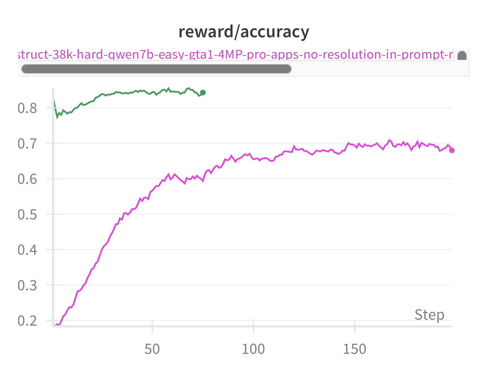
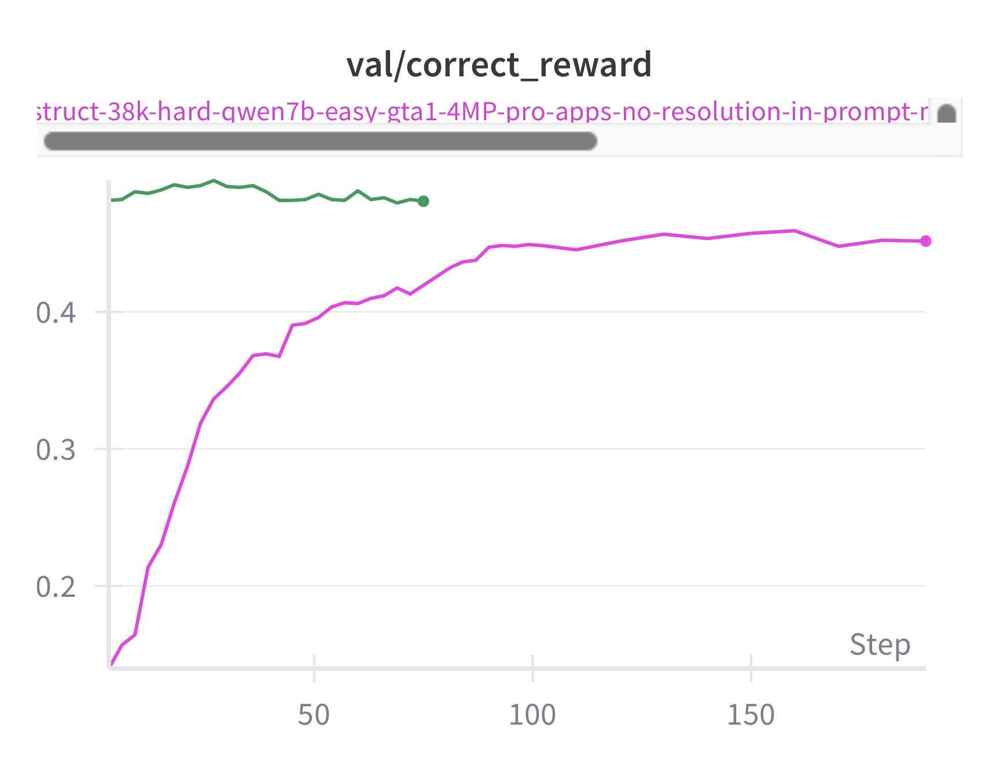

# First attempt at GRPO on SFT model
## Date: 2025-08-27
## Author: Anas

Validation accuracy on Screenshot Pro and training reward curves are presented above. I took the SFT 80k model and continued training it with GRPO. Reward was computed in the same way as GTA where it is non-zero if the prediction is within the bbox and gets to 1.0 as the prediction is closer to the center. Reward function implementation can be found at [llamafactory/agent/train/rl/gui_reward.py](llamafactory/agent/train/rl/gui_reward.py). Overall reward just hovered around the initialization on SS Pro although it is increasing on the training set. Futhermore we tried to initalize the RL run from the base Qwen2.5 7B model but performance was a little worse than the SFT 80k model.