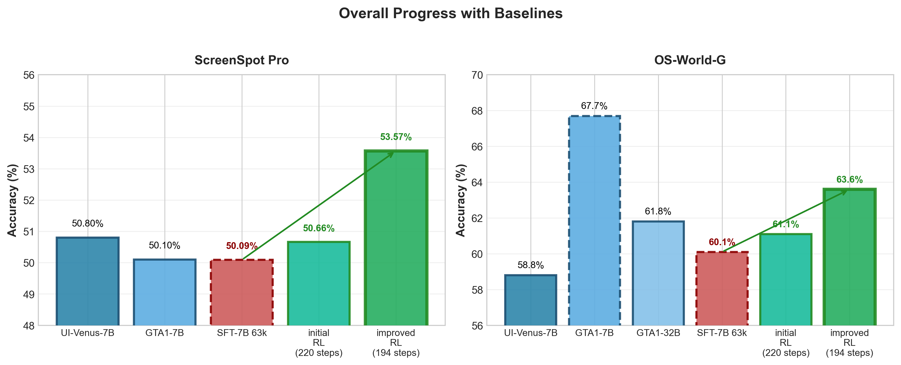
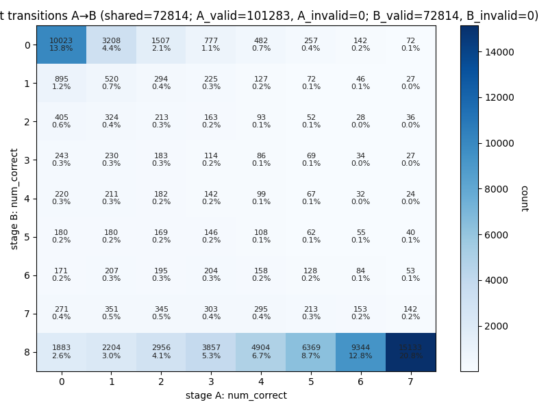
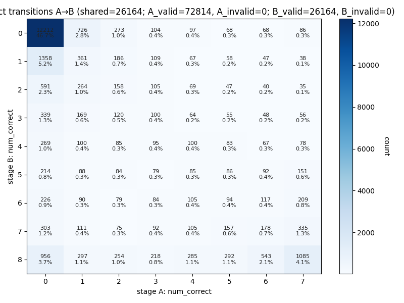
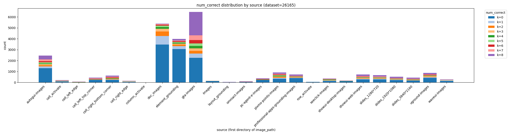

# Improve RL gains through better diversity
## Date: 2025-09-21
## Author: Anas

Our initial RL training had very low gains on top of SFT model and saturated at very low amounts of training. We diagnosed the issue as a lack of exploration in rollouts due to low temperature and the data being too easy.

We are able to achieve very high RL gains by doing multiple rounds of RL training with increasing temperatures and harder data pools. At each round we:
1. Remove all samples where the rollouts are all correct from the previous round's rollouts
2. Increase the sampling temperature by establishing the highest temperature where performance doesn't collapse on OS-World-G.
3. Maintain roughly a 20/80 split between samples with initially 0 rollout reward and samples with initially >0 rollout reward. This is important in later rounds where the bulk of the training data is hard samples.

## Results

| Model | SS Pro Accuracy | OS-World-G Accuracy |
|-------|----------------|----------------|
| SFT-7B 63k | 50.09% | 60.1% |
| SFT-7B 63k + initial RL pipeline (220 steps) | 50.66% | 61.1% |
| SFT-7B 63k + improved RL pipeline (194 steps) | 53.57% | 63.6% |

## Performance at each round of RL training

| Round | SS Pro Accuracy | OS-World-G Accuracy |
|-------|----------------|----------------|
| 1 | 51.42% | 63.1% |
| 2 | 53.57% | 63.6% |

## Temperature Ablation

Performance at each temperature selected in the second round of RL training. (All models used 1.1 temperature for the first round of RL training.)

| Temperature | SS Pro Accuracy | OS-World-G Accuracy |
|-------|----------------|----------------|
| 1.4 | 53.00% | 63.1% |
| 1.7 (selected) | 53.57% | 63.6% |

## Data Pool Difficulty Ablation

Performance at each data pool selected in the second round of RL training. We tried resampling the data such that 20% of the data has 0 rollout reward vs 30% of the data has 0 rollout reward for the second round of RL training.

| Data Pool | SS Pro Accuracy | OS-World-G Accuracy |
|-------|----------------|----------------|
| 20% 0 rollout reward (selected) | 53.57% | 63.6% |
| 30% 0 rollout reward | 52.81% | 62.5% |

## Scaling to stage 3 RL training

We ran into some difficulties scaling to stage 3 RL training. We have narrowed down the issue to 1) an upsampling of noisy data from the data pruning and 2) not making much progress on hard samples (i.e. UI-Vision). 

### Progress on ZERO rollout reward samples across the rounds of RL training

Here we look at the "life-cycle" of ZERO rollout reward samples across the rounds of RL training. We do this by taking the data pruning results at the end of each round and comparing indicies that are present in both rounds (not filtered by the rollout correctness in the previous round's data pruning).

#### Round 1 to Round 2

In the first round most of the progress comes from moving samples from 4/8 - 7/8 correct to 8/8 correct.

#### Round 2 to Round 3

In the second round most of the progress comes from moving samples from 7/8 - 8/8 correct to 8/8 correct. Most samples just stay at 0/8 correct.

Here we plot the source based correctness distribution for the round 3 data pool. We can see that most samples just stay at 0/8 correct for the hardest data sources in UI-Vision and Jedi document (precise text matching tasks).

### A bunch of experiments on the improved data pool

#### Removing lower quality samples
I have removed the lower quality samples by omitting lower quality sources. These filtered samples are visualized in this [HF dataset](https://huggingface.co/datasets/mlfoundations-cua-dev/easyr1-103k-4MP-stage-three-temp-1-7-RL-zero-to-0.2-noise-DONT-TRAIN-ON). The main culprit tends to be ambiguity in instructions for instance sometimes there are two sign-up buttons on the same screen and the instruction is not clear which one to click. 

Small note: the variance in number of steps stems from the filtered samples being slightly different sizes depending on the experiment so that we can maintain a 20% 0 rollout reward split.

#### Remove Pixmo, SeeClick, and UGround experiments

| Ablation | SS Pro Accuracy | OS-World-G Accuracy |
|-------|----------------|----------------|
| Stage 2 Baseline | 53.57% | 63.6% |
| 1.75 temperature at 20% 0 rollout reward (70 steps) | 51.99% | 62.7% |
| 1.9 temperature at 20% 0 rollout reward (70 steps) | 51.73% | 62.5% |
| 2.2 temperature at 20% 0 rollout reward (70 steps) | **53.70%** | 63.1% |

> We get minimal progress on SS Pro with this setup at 2.2 temperature.

#### Keep only UI-Vision, Jedi, and Show-UI Desktop experiments

| Ablation | SS Pro Accuracy | OS-World-G Accuracy |
|-------|----------------|----------------|
| Stage 2 Baseline | 53.57% | 63.6% |
| 2.1 temperature at 20% 0 rollout reward (30 steps) | 53.19% | 63.2% |

#### Keep only UI-Vision, GTA1 (OS-Atlas filtered), Jedi, and Show-UI Desktop experiments

| Ablation | SS Pro Accuracy | OS-World-G Accuracy |
|-------|----------------|----------------|
| Stage 2 Baseline | 53.57% | 63.6% |
| 2.1 temperature at 20% 0 rollout reward (50 steps) | 52.8% | **64.5%** |

#### Increase number of rollouts from 8 to 16

| Ablation | SS Pro Accuracy | OS-World-G Accuracy |
|-------|----------------|----------------|
| Stage 2 Baseline | 53.57% | 63.6% |
| 2.1 temperature at 20% 0 rollout reward (50 steps) | 52.8% | **64.5%** |
| **2.1 temperature at 20% 0 rollout reward (58 steps) + 16 rollouts** | 53.57% | 64.0% |

> This setup gives us better OS-World-G with no SS Pro gains over the stage 2 baseline but very very minimal.

> We get progress on OS-World-G with this setup.

### Dense rewards
My main hypothesis is that the hard samples are not getting much progress because the rewards are too sparse especially cause these bboxes tend to be smaller. I have tried using dense rewards and the progress is a bit better but not by much.

#### Dense rewards with UI-Vision, GTA1 (OS-Atlas filtered), Jedi, and Show-UI Desktop experiments

| Ablation | SS Pro Accuracy | OS-World-G Accuracy |
|-------|----------------|----------------|
| Stage 2 Baseline | 53.57% | 63.6% |
| 1.8 temperature at 20% 0 rollout reward (50 steps) | 52.37% | 62.5% |
| 2.0 temperature at 20% 0 rollout reward (50 steps) | 52.62% | 62.5% |
| 2.0 temperature at 20% 0 rollout reward (116 steps) - ~2x epochs of the run above | 52.18% | **64.89%** |
| 2.1 temperature with **NO 0 rollout reward filtering** (50 steps) | 52.30% | 61.3% |

> The two epoch run has some progress on OS-World-G.
