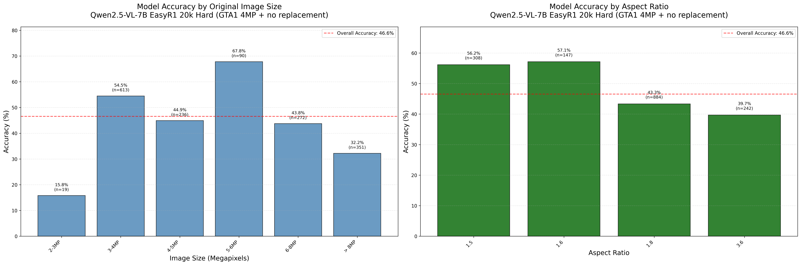
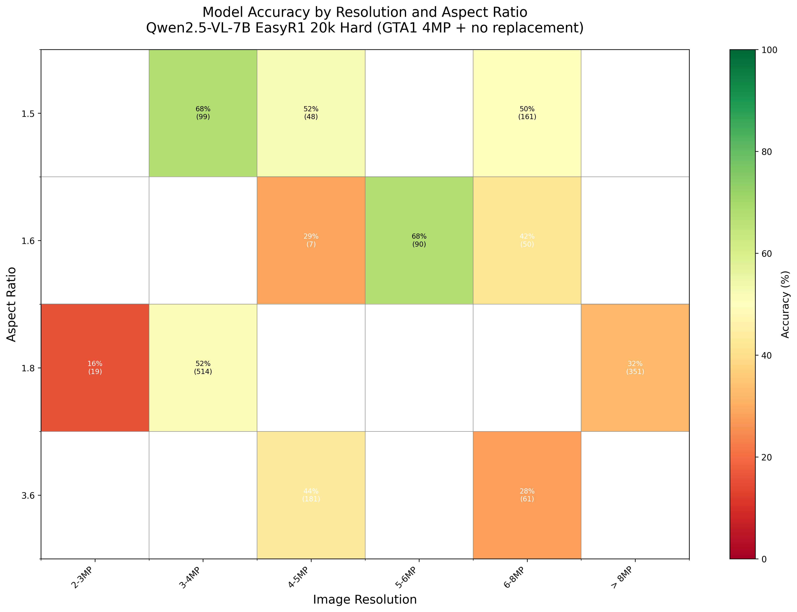
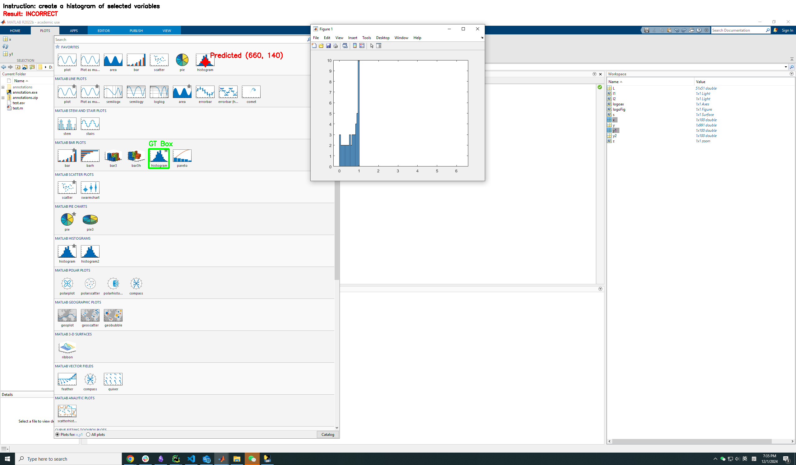
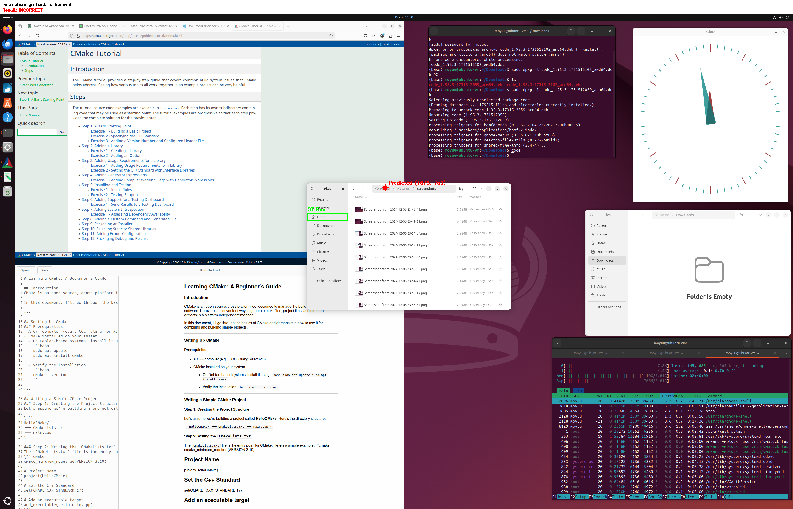
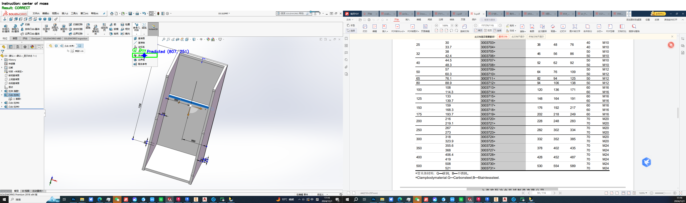

# Performance on SS Pro at different resolutions and aspect ratios
## Date: 2025-08-22
## Author: Anas

We evaluated the 20k sample (without replacement) trained 7B model from [how_does_scaling_data_impact_sft_?.md](how_does_scaling_data_impact_sft_?.md) on SS Pro at each num pixels and aspect ratio.

A few observations:
- Single screen samples at low resolutions (2-3MP) and aspect ratios (1.8) are the most challenging. (maybe there isn't enough data that looks like this?)
- The second most challenging is double screen samples at high resolutions (6-8MP) and aspect ratios (3.6)
- The third most challenging is ultra-high resolution single screen samples (>8MP)

## Results

### Performance by Image Resolution

| Image Size (Megapixels) | SS Pro Accuracy | Sample Count |
|-------------------------|-----------------|--------------|
| 2-3MP | 15.79% | 19 samples |
| 3-4MP | 54.49% | 613 samples |
| 4-5MP | 44.92% | 236 samples |
| 5-6MP | 67.78% | 90 samples |
| 6-8MP | 43.75% | 272 samples |
| > 8MP | 32.19% | 351 samples |

### Performance by Aspect Ratio

| Aspect Ratio | SS Pro Accuracy | Sample Count |
|--------------|-----------------|--------------|
| 1.5 | 56.17% | 308 samples |
| 1.6 | 57.14% | 147 samples |
| 1.8 | 43.33% | 884 samples |
| 3.6 | 39.67% | 242 samples |

**Overall Accuracy: 46.55%**  
**Total Samples: 1,581**  
**Correct Predictions: 736**

## Additional Observations

### Some samples have multiple correct answers but only one is shown in the dataset

### Model generalizes surprisingly well to chinese interfaces but this will be hard to collect data for?

