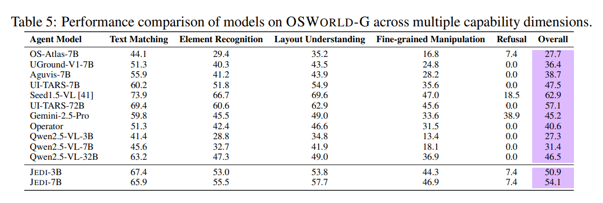

# Refusal Training

We create a refusal dataset by reannotating our filtered GTA1 data: [dataset](https://huggingface.co/datasets/mlfoundations-cua-dev/easyr1-grounding-gta1-4MP-easy-qwen7b-hard-gta1-7b)
Our goal is to generate **subtly** wrong instruction the model should learn to refuse 
The annotation samples a prompt from 3 different scenarios:
- Hallucinated GUI element with similar semantics
- Changed description of existing GUI element
- Infeasible instruction 

## Experiment
We train a model on our (?) data with and without infusing ? samples of our refusal dataset.
We evaluate on OS World G without refusal (? samples) and [OS World G refusal split](https://huggingface.co/datasets/mlfoundations-cua-dev/osworld-refusals) (54 samples)

## JEDI refusal experiment
The [JEDI paper](https://arxiv.org/pdf/2505.13227) (which also introduced the OS World G benchmark) uses following method to generate refusal data:
"To enhance the model’s ability to identify and reject infeasible actions, we construct a refusal part in
out dataset by mismatching existing instructions with unrelated screenshots, yield over 2.6 million
examples. We further sample and manually inspect a subset of these examples to verify that the vast
majority indeed reflects truly infeasible actions."
This gives **less subtle** refusal examples.
They publish this refusal data and report that training on 5k examples did not improve refusal capabilities meaningfully.
"Notably, although we included refusal data during training to
encourage the model to reject instructions referring to elements not present on the screen, the model
rarely produces refusal responses."

 

