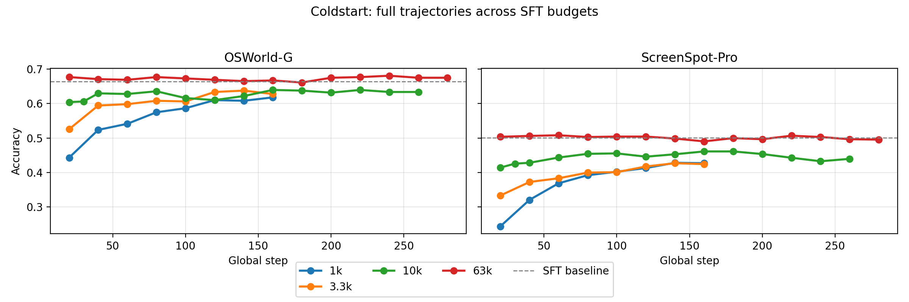
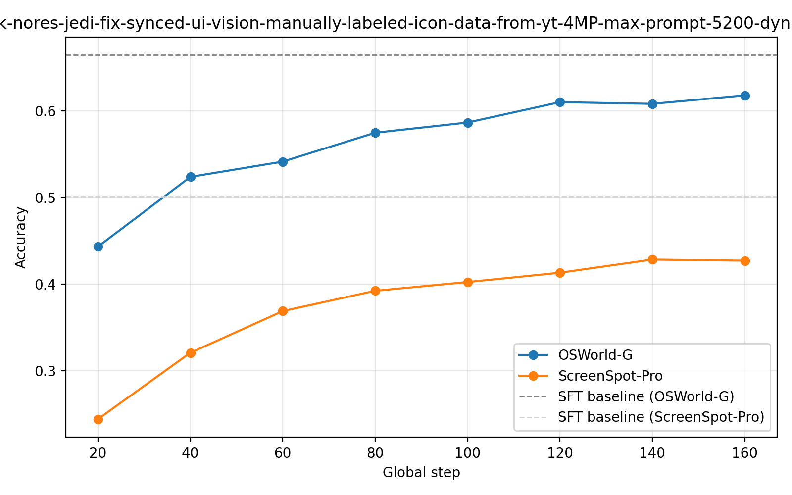
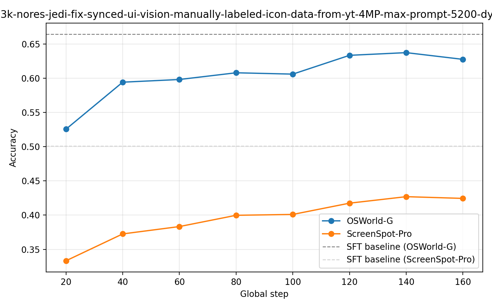
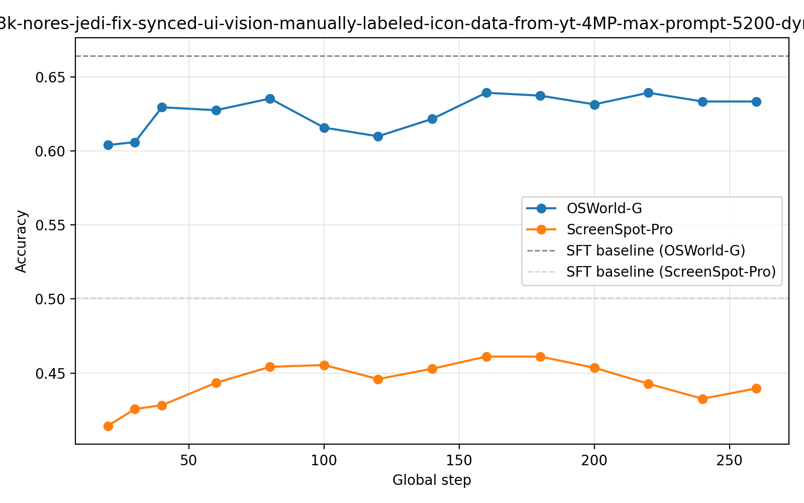

# RL Coldstart Experiments
## Date: 2025-09-16
## Author: Anas

We are running RL coldstart experiments to see how much the gains from RL training are affected by the amount of data used for SFT.
We ran RL on Qwen2.5-VL-7B-Instruct models trained on 1k, 3.3k, 10k, and 63k samples (single epoch of SFT).

## Results

| SFT Budget | OSWorld-G | ScreenSpot-Pro |
|---|---:|---:|
| 1k | 0.6176 | 0.4282 |
| 3.3k | 0.6373 | 0.4269 |
| 10k | 0.6392 | 0.4611 |
| 63k | 0.6804 | 0.5079 |

> Table shows best accuracy across all evaluated steps for each model on each benchmark. The OSWorld-G accuracy is not including the refusal subset so the numbers are higher than the ones in the main plots.

### Per-step scaling plots

- 1k: 
- 3.3k: 
- 10k: 
- 63k: 

