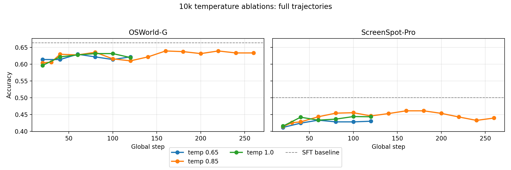
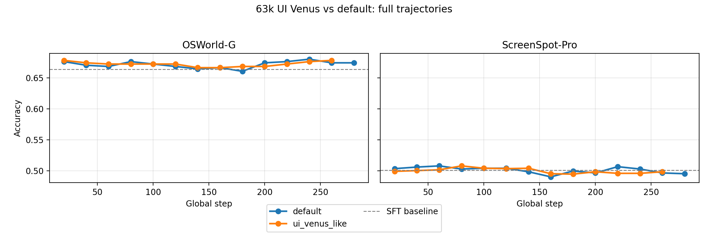

# RL Parameter Ablations
## Date: 2025-09-16
## Author: Anas

RL parameter ablations trying different temperature, KL divergence weight, and learning rate.

## Results

### Temperature (10k SFT)

| Variant | OSWorld-G | ScreenSpot-Pro |
|---|---:|---:|
| temp = 0.65 | 0.6294 | 0.4333 |
| temp = 0.85 (baseline) | 0.6392 | 0.4611 |
| temp = 1.0 | 0.6314 | 0.4440 |

> Table shows best accuracy across all evaluated steps for each model on each benchmark. The OSWorld-G accuracy is not including the refusal subset so the numbers are higher than the ones in the main plots.

### UI Venus parameters ablation (LR = 4e-7, KL = 4e-3) (63k SFT)

| Variant | OSWorld-G | ScreenSpot-Pro |
|---|---:|---:|
| baseline (LR = 1e-6, KL = 1e-2) | 0.6804 | 0.5079 |
| ui_venus_like (LR = 4e-7, KL = 4e-3) | 0.6784 | 0.5079 |

Footnote: Table shows best accuracy across all evaluated steps for each variant on each benchmark.

