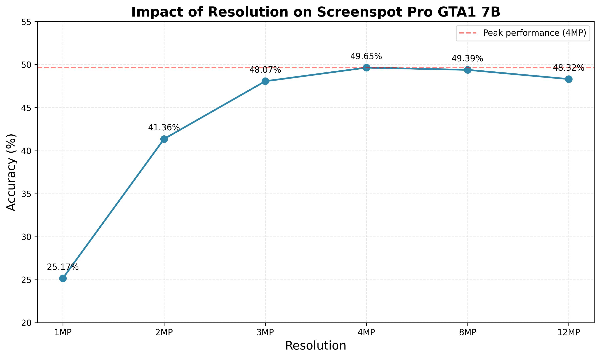

# What is the impact of resolution on multiple benchmarks for GTA1 7B?
## Date: 2025-08-20
## Author: Anas

To understand the impact of resolution on GTA1 7B performance, we evaluated the model across three benchmarks at various resolutions. The results show that different benchmarks benefit differently from increased resolution:

- **Screenspot Pro**: Shows the most dramatic improvement, requiring 4MP to achieve best results (49.65% vs 25.17% at 1MP). This explains why previous results were stagnant and highlights the need for higher resolution training.
- **Screenspot V2**: Already performs well at 1MP (89.49%) with peak performance at 2MP (91.83%).
- **Showdown Clicks**: Shows minimal improvement beyond 1MP, plateauing at 68.76% from 2MP onwards.

Overall, while higher resolutions (>4MP) show diminishing returns across all benchmarks, the optimal resolution varies by task complexity.

## Results

| Min Pixels | Max Pixels | Screenspot Pro | Screenspot V2 | Showdown Clicks |
|------------|------------|----------------|---------------|-----------------|
| No Limit        | 1M        | 25.17%         | 89.49%        | 68.58%          |
| No Limit        | 2M        | 41.36%         | 91.83%        | 68.76%          |
| No Limit        | 3M        | 48.07%         | 91.57%        | 68.76%          |
| No Limit        | 4M        | 49.65%         | 90.40%        | 68.76%          |
| No Limit      | 8M        | 49.39%         | 90.27%        | 68.76%          |
| No Limit       | 12M        | 48.32%         | 90.27%        | 68.76%          |
